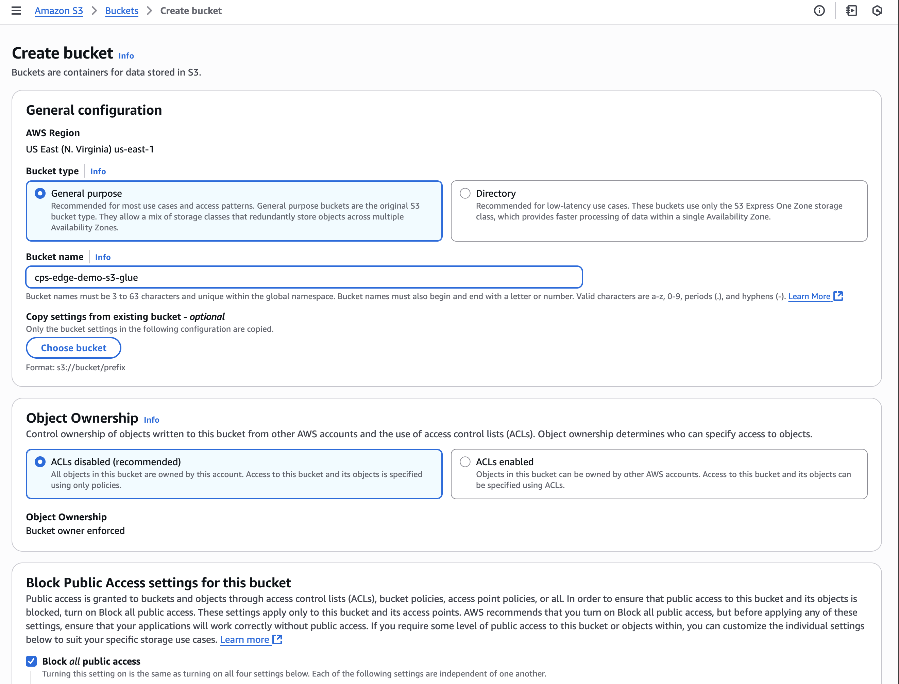
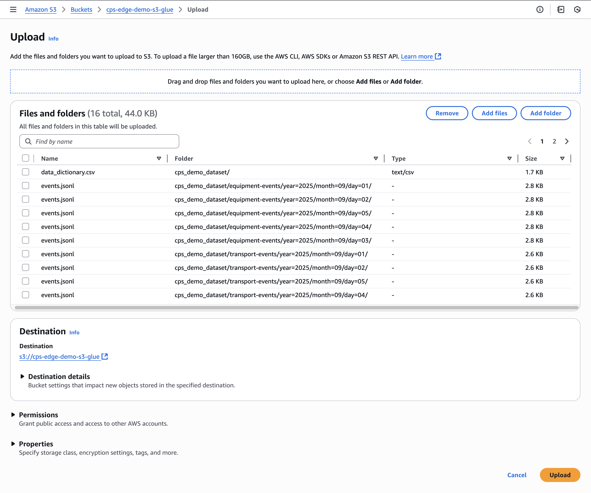
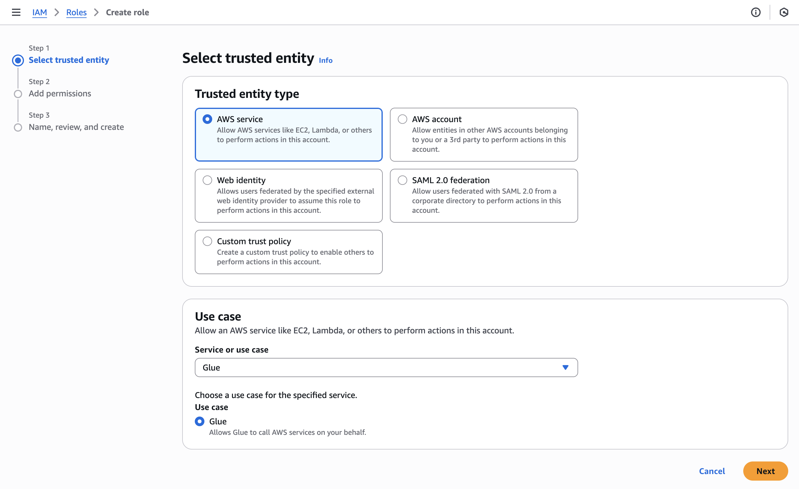
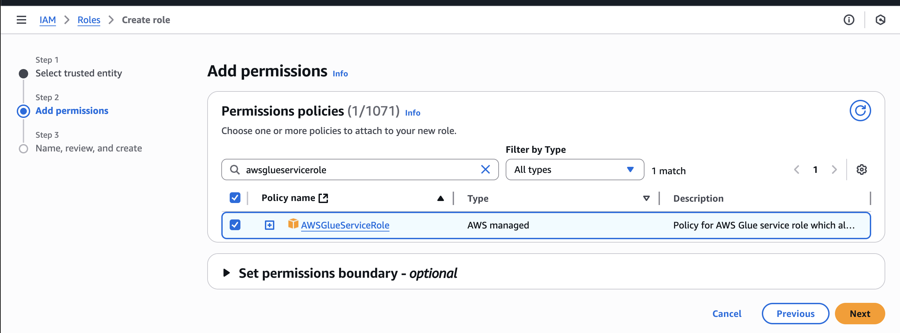
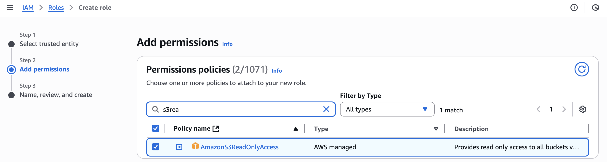
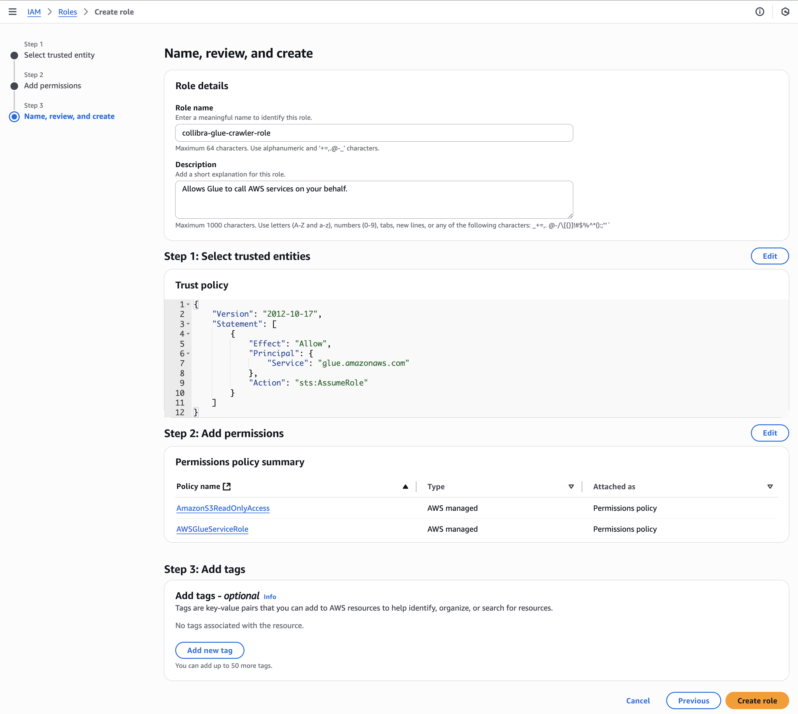

# AWS Setup

## 1) Create an S3 bucket and upload the demo dataset
1. S3 → **Create bucket** (e.g., `cps-edge-s3-glue-demo`). Keep **Block all public access** ON and default encryption (SSE‑S3).

2. Upload the folder **`cps_demo_dataset`** with three prefixes:
   - `shipment-events/…`
   - `transport-events/…`
   - `equipment-events/…`
   Example partitioning: `…/year=2025/month=09/day=01/events.jsonl`.

## 2) Create the **Glue crawler service role**
1. IAM → **Roles → Create role** → AWS service → **Glue** (trust `glue.amazonaws.com`).

2. Attach policies:
   - `AWSGlueServiceRole`
   - `AmazonS3ReadOnlyAccess` (or a bucket‑scoped custom policy).

3. Name it **`collibra-glue-crawler-role`** and copy its **Role ARN**.

## 3) Create the **Edge connection IAM user** and attach permissions
1. IAM → **Policies → Create policy** → JSON → paste `templates/iam/collibra-edge-glue-policy.json` and replace the account ID.
2. IAM → **Users → Create user** → attach the policy.
3. In the user → **Security credentials** → **Create access key**. Copy the Access key ID and Secret. You’ll paste these in Collibra Edge.

## 4) (Optional) Lake Formation
If Lake Formation governs the catalog, grant the `collibra-glue-crawler-role` the necessary data location & catalog permissions.

## 5) Athena query workgroup results (unblocks the Run button)
Athena → Query editor → **Workgroup: primary → View workgroup → Edit** → set **Result location** to
`s3://cps-edge-s3-glue-demo/athena-results/`. This enables query execution.

## 6) Network
Ensure the Edge host can reach `glue.<region>.amazonaws.com` and `s3.<region>.amazonaws.com` over 443.
