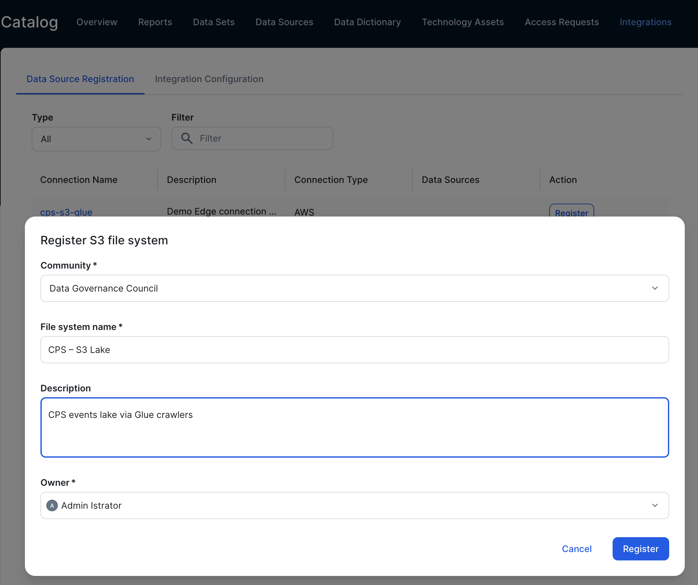
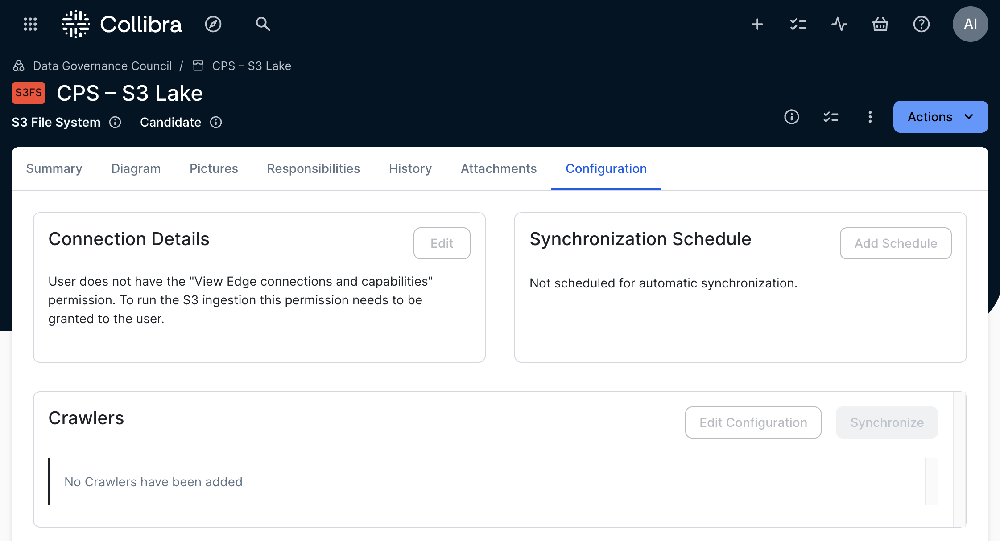
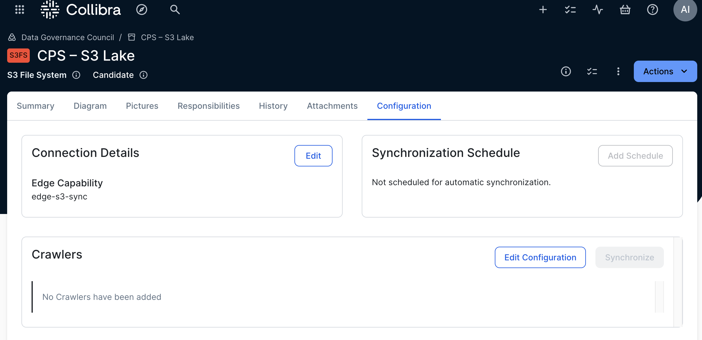
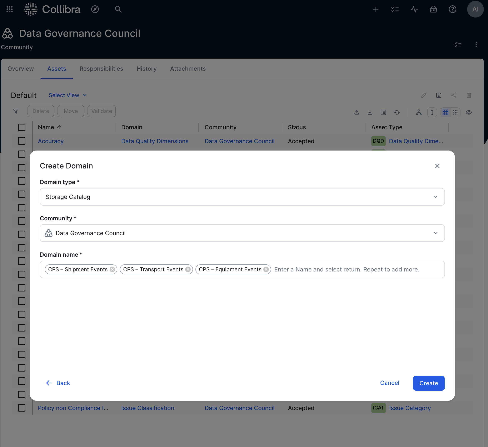
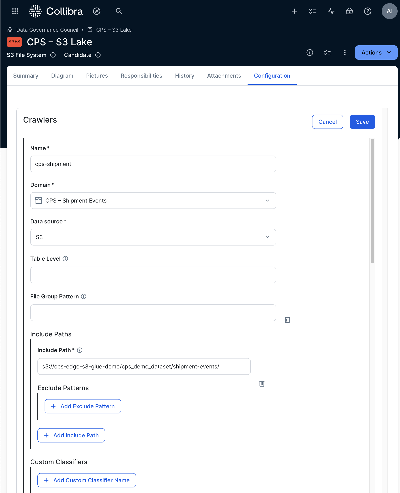
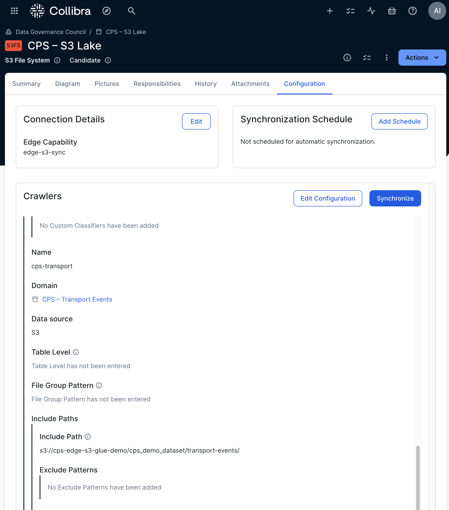
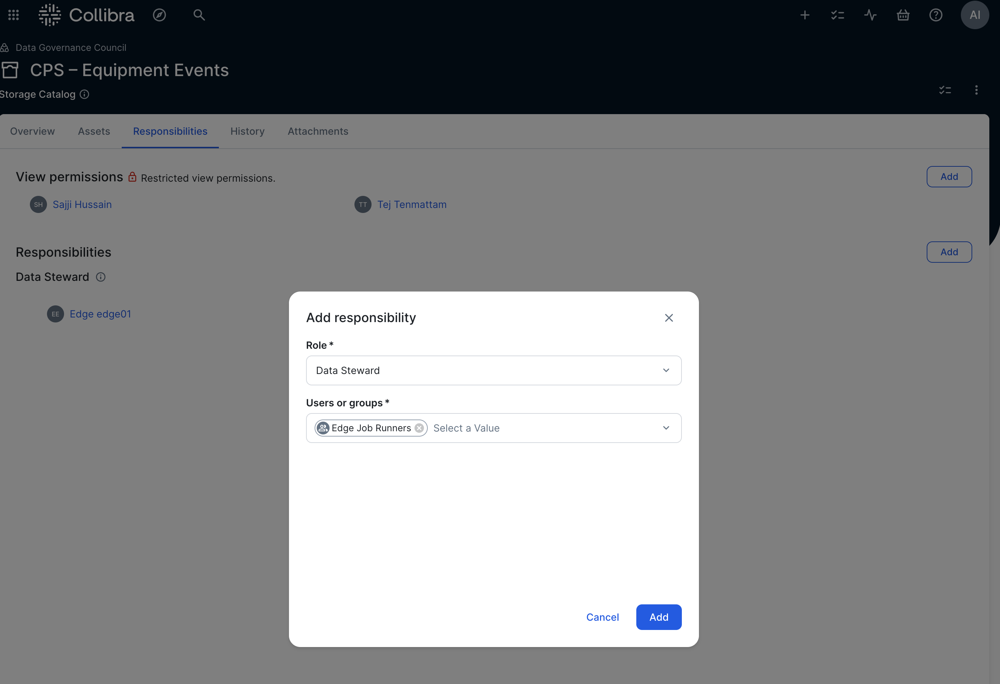
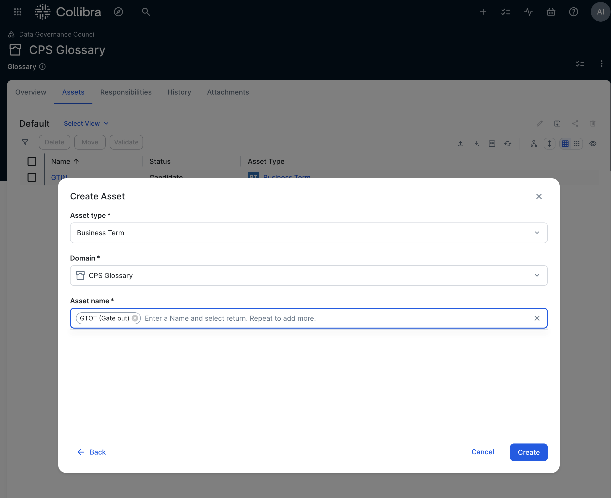
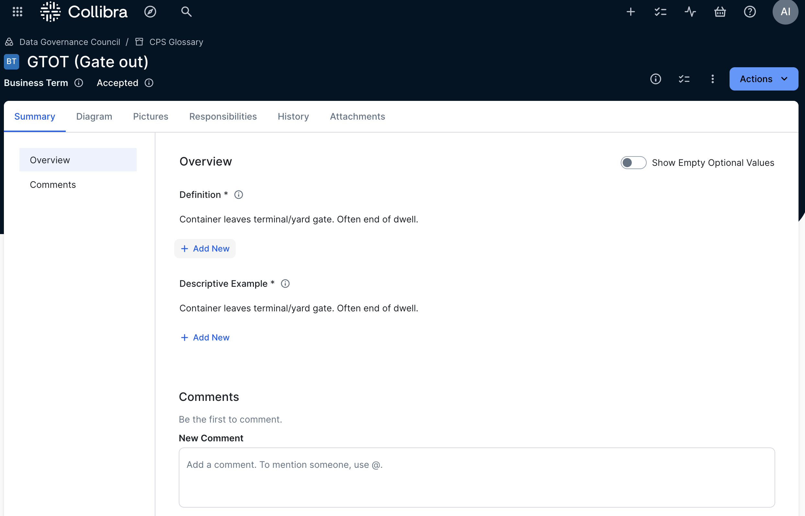
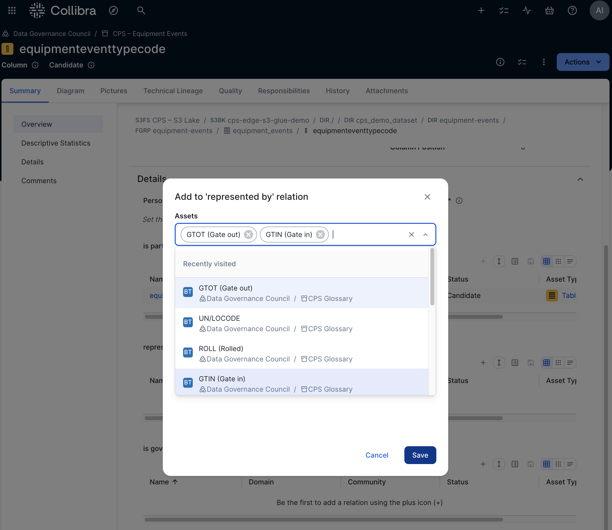

# Collibra Setup (CPSH + Edge)

## 1) Edge → AWS connection
- **Settings → Edge → Sites → `Your site` → Connections → Create**
- Provider: **AWS (for S3)**
- Auth: **IAM** → paste the Edge IAM **Access key ID / Secret access key**.

## 2) Edge capability: **S3 synchronization**
- **Sites → `Your Site` → Capabilities → Add → “S3 synchronization”**
- **AWS Connection**: select the one above
- **IAM role**: `arn:aws:iam::<acct>:role/collibra-glue-crawler-role`
- Keep **“Delete Glue database left after previous synchronization”** checked to auto‑clean prior DBs.

## 3) Register the S3 File System
- Make sure the user has the "Edge - View Edge connections and capabilities” permission.

- **Catalog → Register data source → S3 via Edge**

- Community: your demo community; Name: **CPS – S3 Lake**.

- Save; open the asset → **Configuration → Connection details → Edit** → Runtime **Edge** → select your capability.

## 4) Create three **Storage Catalog** domains
- **CPS – Shipment Events**, **CPS – Transport Events**, **CPS – Equipment Events**.

## 5) Define three **crawlers** on the S3 File System asset
- `cps-shipment` → `s3://<bucket>/cps_demo_dataset/shipment-events/`
- `cps-transport` → `s3://<bucket>/cps_demo_dataset/transport-events/`
- `cps-equipment` → `s3://<bucket>/cps_demo_dataset/equipment-events/`
Assign each crawler to its matching domain; one Glue DB will be produced per domain at sync time.

## 6) Run the synchronization
Start from the S3 File System asset (or schedule). Edge will create crawlers, run them, ingest Glue DBs into Collibra, and delete crawlers afterwards.

## 7) Governance 
1. **Add Owner/Steward** on the three domains and the three tables.

2. **Glossary**: create *CPS Glossary* and terms: **GTIN**, **GTOT**, **ARRI**, **ROLL**, **UN/LOCODE**. 
- GTIN (Gate in) – Container enters terminal/yard gate. Often start of dwell.
- GTOT (Gate out) – Container leaves terminal/yard gate. Often end of dwell.
- ARRI (Arrived) – Vessel/transport call actual or estimated arrival at a facility/port.
- ROLL (Rolled) – Planned call skipped/postponed; cargo rolled to a later call/voyage.
- UN/LOCODE – 5‑character location code per UNECE (e.g., USNYC, SG SIN).

Link to columns (`transporteventtypecode`, `equipmenteventtypecode`, `location`).

3. **Promote** key tables/columns **Candidate → Accepted**.
4. **Policy**: create *External Sharing of CPS Events* policy and relate it to your tables. If needed, add relation types **Policy Governs → Table/Column/S3 File System** and include them in a **Scope**, then move your domains into that scope.
5. **Athena**: save the rolled‑calls query and add the **Saved Query link** as a Related resource on a Collibra asset; attach the `.sql` file for portability.
