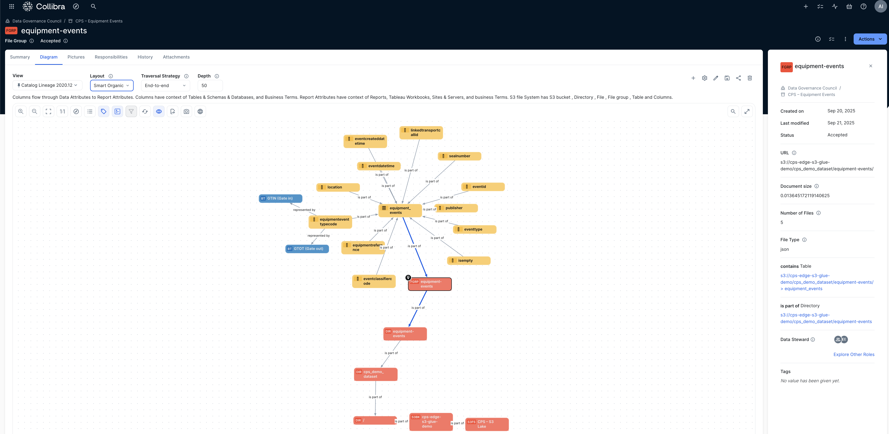

# Demo Flow (script + queries)

## Storyline (~7 minutes)
- *Findable*: search for “equipment events” and open the **equipment_events** table.

- *Trust*: show **Owner/Steward**, **Accepted** status, and **Policy → Is governed by** relation.


- *Lineage*: Assets --> equipment_events (File Group asset type) --> Diagram

- *Meaning*: open `equipmenteventtypecode` and show **GTIN/GTOT** glossary relations.

- *Actionable*: click **Open in Athena (Saved Query)** to run **Rolled Calls – Last 3 Days**.


## Athena: Rolled Calls – Last 3 Days
Use the universal version that works whether `location` is a ROW or a JSON string:

```sql
WITH t AS (
  SELECT
      carriervoyagenumber,
      vesselimonumber,
      json_extract_scalar(CAST(location AS JSON), '$.UNLocationCode') AS unloc,
      try(from_iso8601_timestamp(regexp_replace(eventdatetime, 'Z?$', 'Z'))) AS event_ts
  FROM "<transport_db>".transport_events
  WHERE transporteventtypecode = 'ROLL'
)
SELECT carriervoyagenumber, vesselimonumber, unloc,
       COUNT(*) AS rolled_count, MAX(event_ts) AS last_roll_event
FROM t
WHERE event_ts >= date_add('day', -3, current_timestamp)
GROUP BY 1,2,3
ORDER BY rolled_count DESC, last_roll_event DESC;
```